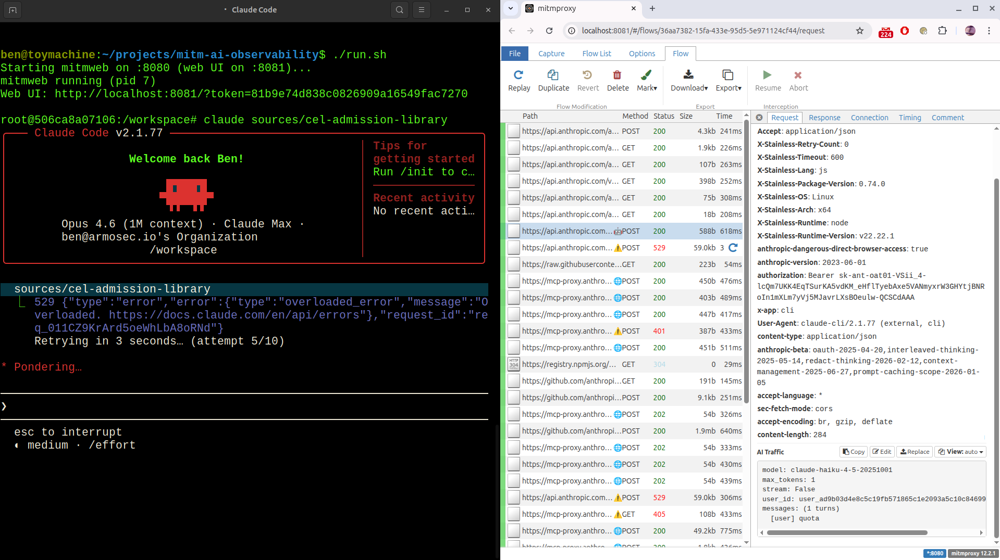

# MITM Claude Code observability

> 🔍 **Do you know what your Claude Code is doing?** Would you like to see how your Agents are interacting with the world? **You are at the right place.**

A containerized environment for intercepting and inspecting all TLS traffic between Claude Code and Anthropic's API using [mitmproxy](https://mitmproxy.org/). Run Claude Code inside the container and observe every API call — prompts, responses, token usage, tool calls — in real time through mitmweb's browser UI.



## Why

AI coding assistants like Claude Code communicate with LLM APIs over encrypted HTTPS. This makes it impossible to see what's actually being sent and received without TLS interception. This project packages mitmproxy as a forward proxy inside a container alongside Claude Code, so all traffic is transparently decrypted and logged — no changes needed to Claude Code itself.

This is useful for:

- **Observability**: see full prompt content, system prompts, model selection, and token usage
- **Cost analysis**: extract `input_tokens` and `output_tokens` from every API call
- **Security auditing**: inspect what data leaves your machine (code, secrets, file contents)
- **Tool/MCP visibility**: observe tool calls, their parameters, and results

## What's in the container

| Component | Purpose |
|-----------|---------|
| Python 3.12 | Runtime for mitmproxy |
| mitmproxy | Forward proxy with TLS interception |
| Node.js 22 | Runtime for Claude Code |
| Claude Code CLI | Anthropic's AI coding assistant |
| mitmproxy CA cert | Installed in system trust store + `NODE_EXTRA_CA_CERTS` |

## Quick start

Run the pre-built image directly (supports both amd64 and arm64/Apple Silicon):

```bash
docker run -it --rm \
    -p 8081:8081 \
    -v "$HOME":/workspace:z \
    -v "$HOME/.claude":/root/.claude:z \
    -v "$HOME/.claude.json":/root/.claude.json:z \
    hisu/mitm-ai-observability
```

Your existing Claude Code authentication (`~/.claude/.credentials.json`) is mounted into the container, so no API key is needed. If you prefer using an API key instead, pass `-e ANTHROPIC_API_KEY=sk-ant-...` before the image name.

This starts the container with:
- mitmweb proxy running in the background (port 8080)
- mitmweb UI accessible from the host at the URL printed on startup (port 8081)
- your home directory mounted at `/workspace`
- your Claude Code config (`~/.claude` and `~/.claude.json`) mounted for authentication and settings

### Building from source

```bash
docker build -f Containerfile -t hisu/mitm-ai-observability .
```

A convenience script `run.sh` is included if you clone the repo.

### Use Claude Code

Inside the container shell:

```bash
cd /workspace/your-project
claude
```

All traffic to `api.anthropic.com` is intercepted. Open the mitmweb URL (printed at container start, includes an auth token) in your browser to inspect flows.

## Files

| File | Description |
|------|-------------|
| `Containerfile` | Image definition — installs mitmproxy, Claude Code, and the CA certificate |
| `entrypoint.sh` | Starts mitmweb in the background with the AI addon, prints the web UI URL, drops to a shell |
| `run.sh` | Convenience wrapper for `docker run` with all the right flags |
| `addons/ai_contentview.py` | mitmproxy addon — AI traffic content view, flow markers, and cost estimates |

## Configuration

### Environment variables

| Variable | Default | Description |
|----------|---------|-------------|
| `ANTHROPIC_API_KEY` | (optional) | Anthropic API key — used by the AI Explain feature and as a fallback if mounted `~/.claude` credentials are unavailable |
| `PROXY_PORT` | `8080` | mitmproxy listen port |
| `MITMWEB_PORT` | `8081` | mitmweb UI port |

### Volume mounts (configured in `run.sh`)

| Host path | Container path | Purpose |
|-----------|---------------|---------|
| `~/sources` | `/workspace` | Your source code |
| `~/.claude` | `/root/.claude` | Claude Code credentials and session data |
| `~/.claude.json` | `/root/.claude.json` | Claude Code onboarding state and project config |

### Customizing `run.sh`

Edit `run.sh` to change the source directory mount, add more environment variables, or forward additional ports.

## AI Traffic addon

A custom mitmproxy addon (`addons/ai_contentview.py`) automatically detects and enriches AI-related traffic in the mitmweb UI. It provides two features: a **custom content view** that prettifies raw JSON/SSE into a readable summary, and **flow markers** that tag AI flows with emoji icons and one-line descriptions directly in the flow list.

### Supported protocols

| Protocol | Hosts | What's parsed |
|----------|-------|---------------|
| Anthropic Messages API | `api.anthropic.com` | Requests (model, messages, tools, system prompt) and responses (streaming SSE and JSON, token usage, cost estimates, tool calls, thinking blocks) |
| MCP (JSON-RPC 2.0) | `mcp-proxy.anthropic.com` | Method calls, server capabilities, tool listings, errors |
| OpenAI Chat Completions | `api.openai.com` | Requests and responses (streaming and non-streaming), tool calls, token usage |
| Google Gemini | `generativelanguage.googleapis.com` | Requests and responses, function calls, usage metadata |
| Claude Code telemetry | `api.anthropic.com` | Event batches with highlighted key events (API success/error, tool use, MCP connections, rate limits), sensitive field detection |

### Flow markers

AI flows are tagged in the flow list so you can spot them at a glance without clicking into each one:

| Marker | Traffic type | Comment example |
|--------|-------------|-----------------|
| :robot: | LLM request (Anthropic, OpenAI, Gemini) | `LLM \| claude-sonnet-4 \| 5 msgs \| 12 tools` |
| :globe_with_meridians: | MCP protocol | `MCP \| tools/list \| server-id` |
| :bar_chart: | Telemetry batch | `Telemetry \| 24 events` |
| :warning: | Error response (HTTP 4xx/5xx or MCP error) | `LLM \| claude-sonnet-4 \| HTTP 429` |

When the response arrives, the marker comment is enriched with token counts and estimated cost (e.g. `in=1234 out=567 cached=890 | $0.003450`).

### Custom content view

Select the **"AI Traffic"** view in mitmweb's response/request detail pane (it is auto-selected for recognized AI traffic). Instead of raw JSON or SSE event streams, you get a structured summary: model, token usage, cost estimate, conversation turns, tool calls with parsed arguments, and more.

### AI Explain

Select the **"AI Explain"** view from the content view dropdown on any flow (request or response pane). This calls Claude Sonnet to generate a plain-language explanation of the HTTP transaction — what the request does, key parameters, what the response contains, and any notable observations.

- Works on **any HTTP flow**, not just AI traffic
- Results are **cached per flow** so re-selecting the view is instant
- The API call runs in the background — you'll see a "Generating..." message on first click; re-select the view after a few seconds to see the result
- Requires an Anthropic API key (see [Environment variables](#environment-variables))

### What to look for in mitmweb

Once Claude Code is running, the mitmweb UI shows all intercepted HTTPS flows. Key things to inspect:

| What | Where to find it |
|------|-----------------|
| Full prompts | Request body of `POST api.anthropic.com/v1/messages` — or select the "AI Traffic" content view for a summary |
| Model in use | Flow comment in the flow list, or `model` field in the content view |
| System prompt | "AI Traffic" content view shows block count and preview |
| Token usage | Flow comment (after response), or usage section in the content view |
| Cost estimate | Flow comment (after response), or usage section in the content view |
| Tool definitions | "AI Traffic" content view lists tool names |
| Tool calls | "AI Traffic" content view shows tool name, ID, and parsed input JSON |
| MCP calls | Flows marked with :globe_with_meridians: — content view shows JSON-RPC method, server info, capabilities |
| API key | `x-api-key` request header |

## Logs

mitmweb output is written to `/var/log/mitmweb.log` inside the container. To follow it:

```bash
tail -f /var/log/mitmweb.log
```

## Security notes

- The mitmproxy CA private key (`/root/.mitmproxy/mitmproxy-ca.pem`) can decrypt any traffic routed through the proxy — the container should not be shared or published with these keys
- Captured traffic contains API keys and potentially sensitive code — treat mitmweb access as privileged
- The mitmweb UI is protected by a random auth token printed at startup
- This is a PoC/research tool, not a production AI gateway — see the research docs in this repo for production approaches
